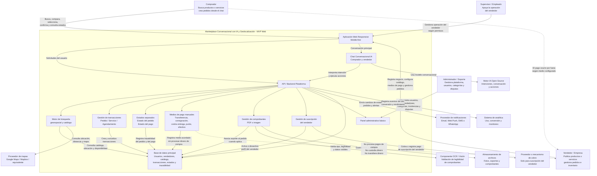

```mermaid
flowchart TB
    %% =========================
    %% Actores principales
    %% =========================
    comprador["Comprador<br/>Busca productos o servicios<br/>crea pedidos desde el chat"]

    vendedor["Vendedor / Empresa<br/>Publica productos o servicios<br/>gestiona pedidos e inventario"]

    supervisor["Supervisor / Empleado<br/>Apoya la operación<br/>del vendedor"]

    admin["Administrador / Soporte<br/>Gestiona plataforma,<br/>usuarios, categorías y disputas"]

    %% =========================
    %% Plataforma principal
    %% =========================
    subgraph plataforma["Marketplace Conversacional con IA y Geolocalización - MVP Web"]
        web["Aplicación Web Responsive<br/>Mobile-first"]

        chat["Chat Conversacional IA<br/>Comprador y vendedor"]

        api["API / Backend Plataforma"]

        busqueda["Motor de búsqueda<br/>geoespacial y catálogo"]

        pedidos["Gestión de transacciones<br/>Pedido / Servicio / Agendamiento"]

        estados["Estados separados<br/>Estado del pedido<br/>Estado del pago"]

        pagosManual["Medios de pago manuales<br/>Transferencia, consignación,<br/>contra entrega, punto, efectivo"]

        comprobantes["Gestión de comprobantes<br/>PDF o imagen"]

        suscripcion["Gestión de suscripción<br/>del vendedor"]

        adminPanel["Panel administrativo básico"]

        data["Base de datos principal<br/>Usuarios, vendedores, catálogo,<br/>transacciones, estados y trazabilidad"]
    end

    %% =========================
    %% Sistemas externos
    %% =========================
    ia["Motor IA Open Source<br/>Intenciones, conversación<br/>y acciones"]

    mapas["Proveedor de mapas<br/>Google Maps / Mapbox / equivalente"]

    ocr["Componente OCR / Visión<br/>Validación de legibilidad<br/>de comprobantes"]

    storage["Almacenamiento de archivos<br/>Fotos, soportes y comprobantes"]

    notificaciones["Proveedor de notificaciones<br/>Email, Web Push, SMS o WhatsApp"]

    analytics["Sistema de analítica<br/>Uso, conversión y monitoreo"]

    cobroSuscripcion["Proveedor o mecanismo de cobro<br/>Solo para suscripción del vendedor"]

    %% =========================
    %% Relaciones de usuarios
    %% =========================
    comprador -->|"Busca, compara, selecciona,<br/>confirma y consulta estados"| web

    vendedor -->|"Registra negocio, configura catálogo,<br/>medios de pago y gestiona pedidos"| web

    supervisor -->|"Gestiona operación del vendedor<br/>según permisos"| web

    admin -->|"Administra usuarios, vendedores,<br/>categorías, incidencias y disputas"| adminPanel

    %% =========================
    %% Relaciones internas
    %% =========================
    web -->|"Solicitudes del usuario"| api
    web -->|"Conversación principal"| chat

    chat -->|"Interpreta intención<br/>y ejecuta acciones"| api
    chat -->|"Usa modelo conversacional"| ia

    api --> busqueda
    api --> pedidos
    api --> estados
    api --> pagosManual
    api --> comprobantes
    api --> suscripcion
    api --> adminPanel
    api --> data

    busqueda -->|"Consulta catálogo,<br/>ubicación y disponibilidad"| data
    pedidos -->|"Crea y actualiza transacciones"| data
    estados -->|"Registra trazabilidad<br/>del pedido y del pago"| data
    pagosManual -->|"Registra medio acordado<br/>sin procesar dinero de compra"| data
    comprobantes -->|"Asocia soporte al pedido<br/>cuando aplica"| data
    suscripcion -->|"Activa o desactiva<br/>perfil del vendedor"| data

    %% =========================
    %% Integraciones externas
    %% =========================
    busqueda -->|"Consulta ubicación,<br/>distancia y mapa"| mapas

    comprobantes -->|"Valida tipo, legibilidad<br/>y datos visibles"| ocr
    comprobantes -->|"Guarda PDF o imagen"| storage

    api -->|"Envía cambios de estado,<br/>pedidos y alertas"| notificaciones

    api -->|"Registra eventos de uso,<br/>conversión y rendimiento"| analytics

    suscripcion -->|"Cobra o registra pago<br/>de suscripción del vendedor"| cobroSuscripcion

    %% =========================
    %% Restricciones importantes
    %% =========================
    pagosManual -.->|"No procesa pagos de compra<br/>No custodia dinero<br/>No transfiere dinero"| vendedor

    comprador -.->|"El pago ocurre por fuera<br/>según medio configurado"| vendedor
```
